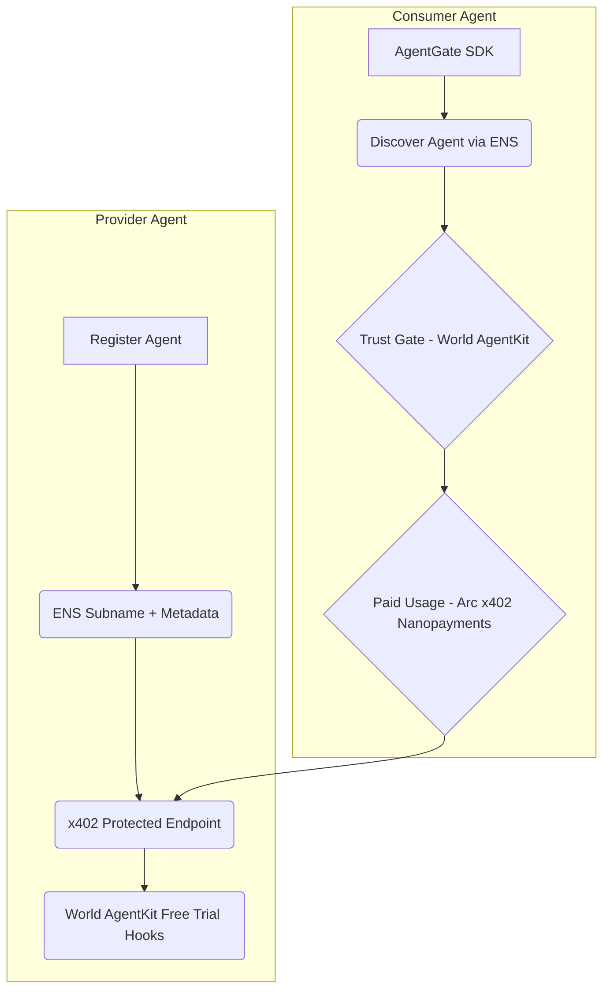

<!-- prettier-ignore -->
<div align="center">

# AgentGate
### Identity and communication network for verified AI agents

[](https://github.com/Byzantium-ETS/ethglobal-2026/actions)
[](LICENSE)

⭐ If you find this project useful, star it on GitHub!

[Overview](#overview) • [Core Integrations](#core-integrations) • [Product Flow](#product-flow-demo) • [Architecture](#architecture) • [Getting Started](#getting-started) • [Resources](#resources)

</div>

**AgentGate** is designed to bridge the gap between AI agents and onchain payments, identity, and trust. Instead of a simple proxy, AgentGate links AI agents to a verified World identity, enabling them to discover, communicate, and transact directly with one another in a secure, verifiable, and economically rational framework.

## Overview

In the rapidly evolving landscape of AI agents, managing payments, establishing verifiable identities, and building trust are paramount. AgentGate provides a robust solution by integrating three core Web3 technologies:

-   **Trust (World AgentKit)**: Incorporates human-backed verification through World AgentKit, linking agents to a verified identity to establish a root of trust and enable free-trial gating.
-   **Identity (ENS)**: Assigns unique ENS subnames (e.g., `agent-name.agentgate.eth`) to verified agents, along with rich metadata for discoverability, communication routing, and capability declarations.
-   **Payments (Arc by Circle)**: Facilitates gasless, per-request nanopayments using USDC between communicating agents. This leverages the x402 protocol, ensuring agents can engage in micro-transactions efficiently during their interactions.

This unique combination addresses the critical needs for a sustainable and scalable agentic economy, ensuring that agents are discoverable, trustworthy, and economically viable.

## Why this combination?

AgentGate brings together these distinct but complementary technologies for several compelling reasons:

-   **Single Product Narrative**: It creates a cohesive story around discoverable, trustworthy, and payable AI agents, simplifying the value proposition.
-   **Shared Technical Thread**: The x402 payment interface serves as a common backbone, connecting disparate functionalities under a unified payment mechanism.
-   **Minimal Scope Drift**: The project directly extends the core concept of an "agentic payment interface," maintaining focus and maximizing development efficiency.

## Core Integrations

AgentGate is built upon three fundamental integrations:

### 1) Arc (Circle): x402 Nanopayments

AgentGate utilizes `@circle-fin/x402-batching` to manage both buyer and seller payment paths. This system allows consumers to make a single USDC deposit and then authorize offchain nanopayments for individual agent interactions. Agent endpoints are protected by x402, enforcing payment requirements and validating settlement.

### 2) ENS: Identity + Discovery

Leveraging `@ensdomains/ensjs`, AgentGate provides programmatic ENS subname creation under a parent domain (`agentgate.eth`). Each agent's ENS record stores vital metadata, including:
-   `description`
-   `io.agentgate.capabilities`
-   `io.agentgate.x402-endpoint`
-   `io.agentgate.x402-price`
-   `io.agentgate.world-verified`

This enables seamless agent discovery and capability resolution.

### 3) World: Human-Backed Agents

Through `@worldcoin/agentkit`, AgentGate integrates human-backed verification. Agents can register their wallets with AgentBook. The server is configured to offer a free-trial mode (e.g., 3-5 free calls per endpoint per human), after which interactions seamlessly transition to the x402 payment path.

## Product Flow (Demo)

The AgentGate product flow is designed for clarity and efficiency:

1.  **Register Agent**: Agents mint a unique `agent-name.agentgate.eth` subname and store their capabilities, x402 endpoint, and pricing in ENS text records.
2.  **Discover Agent**: Consumer agents can list subnames under `agentgate.eth` and resolve selected names to addresses and endpoint metadata.
3.  **Trust Gate**: A consumer agent utilizes World AgentKit proof to access a free-trial mode, receiving 3-5 complimentary calls.
4.  **Paid Usage**: Upon trial exhaustion, subsequent calls necessitate x402 payments, with settlement handled via Arc's USDC nanopayment flow.
5.  **Feedback**: Service quality signals are recorded (onchain or app-level leaderboard) to foster a reputable agent ecosystem.

## Architecture

AgentGate employs a modular monorepo architecture:

-   **SDK package (`packages/sdk`)**: Contains client wrappers for `identity` (ENS register/read/discover), `payments` (x402 client + Arc config), and `trust` (World AgentKit client).
-   **Provider server (`packages/server`)**: Hosts x402-protected endpoints and manages AgentKit free-trial extension hooks.
-   **Demo app/scripts (`demo`)**: Provides end-to-end examples for provider and consumer agents.



## Acceptance Criteria

A successful AgentGate implementation will meet the following criteria:

-   An agent can successfully discover another agent via ENS.
-   A verified human-backed agent receives initial free calls.
-   After free calls, the same endpoint enforces x402 payment.
-   Payment successfully settles via the Arc path in USDC.
-   The live demo clearly showcases all three sponsor integrations as core functionalities, not cosmetic additions.

## Getting Started

To get started with AgentGate, follow these general steps. More detailed instructions will be available in the `demo` directory once the project is further developed.

For hackathon submission rules, AI-use disclosure, demo video requirements, partner-prize preparation, and judging checklists, see [`docs/HACKATHON_SUBMISSION.md`](docs/HACKATHON_SUBMISSION.md).

For Phase 3 smoke checks, live ENS/x402 scripts, actual `agentkit` and x402 payment headers, and the current trust mock boundary while 2C.2/2C.3 are in progress, see [`docs/PHASE_3_SMOKE.md`](docs/PHASE_3_SMOKE.md).

### Prerequisites

-   Node.js (LTS recommended)
-   Yarn or npm
-   Git

### Local Development

1.  **Clone the repository**:
    ```bash
    git clone https://github.com/Byzantium-ETS/ethglobal-2026.git
    cd ethglobal-2026
    ```
2.  **Install dependencies**:
    ```bash
    yarn install # or npm install
    ```
3.  **Set up environment variables**:
    Create a `.env` file in the root directory and configure necessary keys and endpoints for Arc, ENS, and World (e.g., RPC URLs, private keys for demo wallets).
4.  **Run the demo**:
    Build the workspaces, start the provider server, then run the demo package:

    ```bash
    npm run build
    npm --workspace @agentgate/server run start
    npm --workspace agentgate-demo run start
    ```

    By default the demo probes the provider, performs ENS discovery only when `RUN_DEMO_DISCOVERY=true`, and performs the paid call only when `RUN_DEMO_PAID_CALL=true` with a funded buyer key.

<br>

> [!NOTE]
> The project is currently under active development for ETHGlobal. The `demo` folder will contain concrete scripts and a minimal UI/CLI for an end-to-end demonstration.

## Risks and Mitigations

-   **Cross-chain complexity**: Mitigated by keeping ENS and World verification/read paths lightweight and payments strictly on Arc.
-   **Time lost on optional extras**: Mitigated by prioritizing a single, polished end-to-end path.
-   **Demo fragility**: Mitigated by scripting deterministic demo wallets, fixed endpoints, and a fallback CLI mode.
