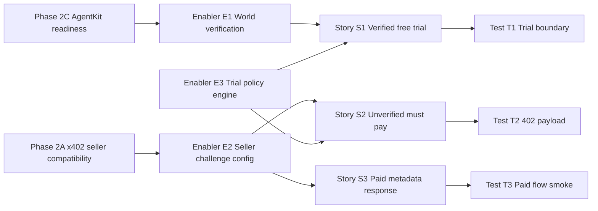

# Project Plan — Phase 3: Server Payment Gate + Trust Gate

## 1) Project Overview

### Feature Summary
Phase 3 implements the server-side policy flow for `POST /call`: **World proof trust check → free-trial gate → x402 payment enforcement**. It upgrades current stubs in `packages/server/src/index.ts` and `packages/server/src/x402Middleware.ts` into a deterministic, demo-ready gate that returns explicit state transitions.

### Business Value
- Converts AgentGate from a simple paid endpoint into a **trust-aware monetization flow**.
- Demonstrates World + Arc integration in a single request lifecycle (strong sponsor narrative).
- Enables a clear product story: verified users receive trial access, then transition to paid usage.

### Success Criteria (Phase 3)
- `POST /call` enforces middleware chain: **World check → trial check → x402 check**.
- Verified identity gets `FREE_TRIAL_LIMIT` free calls (default 5), then receives payment requirement.
- Unverified identity requires payment immediately (unless explicitly configured otherwise).
- Missing/invalid payment returns HTTP `402` with machine-readable challenge payload.
- Paid request returns `{ status: "paid", tx: "..." }` (or equivalent payment metadata).

### Key Milestones
1. Seller config + pricing model wired from env.
2. World proof verification middleware integrated.
3. Free-trial counter implemented with deterministic in-memory semantics.
4. x402 seller middleware validates auth and returns proper 402 challenge.
5. Unified `/call` response contract implemented and validated manually.

### Risk Assessment
| Risk | Likelihood | Impact | Mitigation |
|---|---:|---:|---|
| World proof verification API/sdk ambiguity | Medium | High | Add adapter interface and strict validation errors; provide config-based fallback mode for demo. |
| x402 seller-side validation behavior differs from current assumptions | Medium | High | Wrap vendor API behind local validator module; keep response contract stable. |
| Trial identity key instability (header shape/proof payload) | Medium | Medium | Normalize identity key in one function and log normalized value in debug mode. |
| In-memory counter resets on restart | High | Low | Accept for hackathon scope; document behavior explicitly. |

---

## 2) Work Item Hierarchy

```mermaid
graph TD
    A[Epic #2: AgentGate Epic] --> B[Feature: Phase 3 Server Payment + Trust Gate]

    B --> C[Story: Verified users get free trial]
    B --> D[Story: Unverified users must pay]
    B --> E[Story: Paid requests succeed with payment metadata]

    B --> F[Enabler: World proof verification middleware]
    B --> G[Enabler: Seller pricing and challenge config]
    B --> H[Enabler: Trial counter store and policy evaluator]

    C --> C1[Task: extract and normalize identity key]
    C --> C2[Task: decrement and report remaining calls]
    C --> C3[Test: trial transition boundary tests]

    D --> D1[Task: bypass trial for unverified requests]
    D --> D2[Task: return 402 challenge when no payment]
    D --> D3[Test: anonymous payment-required tests]

    E --> E1[Task: validate x402 auth]
    E --> E2[Task: attach payment metadata to request context]
    E --> E3[Test: paid flow contract tests]

    F --> F1[Task: World header parser]
    F --> F2[Task: AgentKit verification adapter]

    G --> G1[Task: env config for seller wallet/pricing]
    G --> G2[Task: GET price endpoint or challenge payload schema]

    H --> H1[Task: in-memory store keyed by identity+endpoint]
    H --> H2[Task: policy evaluator free/trial/paid-required]
```



---

## 3) GitHub Issues Breakdown

> Notes:
> - Existing parent epic is **#2**.
> - Issue numbers below are placeholders until created.

### Epic Reference
- `#2` — **AgentGate — Epic** (already exists)

### Feature Issue (to create)
```markdown
# Feature: Phase 3 — Server Payment Gate + Trust Gate

## Feature Description
Implement trust-aware server request gating on POST /call by composing World proof verification, free-trial policy, and x402 payment enforcement.

## User Stories in this Feature
- [ ] #P3-S1 - Verified user receives limited free-trial calls
- [ ] #P3-S2 - Unverified user must pay from first call
- [ ] #P3-S3 - Paid request returns successful paid status with payment metadata

## Technical Enablers
- [ ] #P3-E1 - World proof verification middleware and request context mapping
- [ ] #P3-E2 - Seller wallet + pricing + 402 challenge config
- [ ] #P3-E3 - Trial counter store and policy evaluator

## Dependencies
**Blocked by**:
- Phase 2C trust primitives availability (`@worldcoin/agentkit` integration readiness)
- Phase 2A payment primitives compatibility with seller-side x402 validation

## Acceptance Criteria
- [ ] Middleware order is deterministic and documented.
- [ ] Trial and paid states are explicit and machine-readable.
- [ ] HTTP 402 responses include challenge body with price/token/network/payee metadata.

## Labels
`feature`, `priority-critical`, `value-high`, `backend`, `phase-3`

## Epic
#2

## Estimate
M (13 points)
```

### User Story 1 — Verified free trial
```markdown
# User Story: Verified users get N free calls before payment is required

## Story Statement
As a verified agent user, I want a limited free trial on /call so that I can evaluate provider quality before paying.

## Acceptance Criteria
- [ ] Server extracts verified identity from proof and stores it in request context.
- [ ] Calls <= FREE_TRIAL_LIMIT return status free_trial with remaining count.
- [ ] First call after limit requires payment (402 challenge if no payment auth).

## Dependencies
**Blocked by**: #P3-E1, #P3-E3

## Definition of Done
- [ ] Policy behavior validated at boundary (limit and limit+1).
- [ ] Response payload is stable and documented.
- [ ] Negative-path tests for malformed proof are present.

## Labels
`user-story`, `priority-high`, `value-high`, `backend`, `trial-gating`, `phase-3`

## Feature
#P3-FEATURE

## Estimate
5
```

### User Story 2 — Unverified must pay
```markdown
# User Story: Unverified users require payment immediately

## Story Statement
As a provider operator, I want unverified callers to skip free trial and require payment so that free usage is limited to trusted users.

## Acceptance Criteria
- [ ] Missing/invalid proof does not grant trial calls.
- [ ] Request without payment auth receives HTTP 402 challenge.
- [ ] Valid paid request from unverified caller is accepted.

## Dependencies
**Blocked by**: #P3-E2, #P3-E3

## Definition of Done
- [ ] Anonymous path is deterministic.
- [ ] 402 payload contains required payment fields.
- [ ] Paid/unpaid behavior verified with curl script.

## Labels
`user-story`, `priority-high`, `value-high`, `backend`, `payments`, `phase-3`

## Feature
#P3-FEATURE

## Estimate
3
```

### User Story 3 — Paid contract and metadata
```markdown
# User Story: Paid call returns explicit paid status and metadata

## Story Statement
As a consumer agent, I want paid calls to return a clear paid status and payment metadata so that I can audit successful settlement behavior.

## Acceptance Criteria
- [ ] Valid x402 authorization is verified server-side.
- [ ] Payment metadata is attached to request context and emitted in response.
- [ ] Application payload is still returned after payment validation.

## Dependencies
**Blocked by**: #P3-E2

## Definition of Done
- [ ] Payment metadata schema documented.
- [ ] Success and failure examples included in README or docs.

## Labels
`user-story`, `priority-medium`, `value-high`, `backend`, `x402`, `phase-3`

## Feature
#P3-FEATURE

## Estimate
3
```

### Technical Enabler 1 — World verification middleware
```markdown
# Technical Enabler: World proof verification middleware

## Enabler Description
Implement parsing and verification of X-World-Proof header, mapping verified identity into Express request context.

## Technical Requirements
- [ ] Parse and validate proof header shape.
- [ ] Verify proof through AgentKit adapter.
- [ ] Normalize verified identity key for trial store.

## Acceptance Criteria
- [ ] Verified identity attached as typed request context.
- [ ] Invalid proof returns explicit verification error (or configurable fallback).

## Labels
`enabler`, `priority-high`, `value-high`, `backend`, `trust`, `phase-3`

## Feature
#P3-FEATURE

## Estimate
3
```

### Technical Enabler 2 — Seller config + challenge
```markdown
# Technical Enabler: Seller wallet and pricing challenge config

## Enabler Description
Load seller credentials/pricing from env and generate canonical payment challenge for 402 responses.

## Technical Requirements
- [ ] Add seller env vars and validation.
- [ ] Define /call pricing (price, token, network, payee).
- [ ] Ensure 402 challenge payload is consistent across middleware and optional GET /price.

## Acceptance Criteria
- [ ] Missing config fails fast at startup.
- [ ] 402 challenge payload is machine-readable and documented.

## Labels
`enabler`, `priority-critical`, `value-high`, `backend`, `infrastructure`, `phase-3`

## Feature
#P3-FEATURE

## Estimate
2
```

### Technical Enabler 3 — Trial counter policy engine
```markdown
# Technical Enabler: Free-trial counter and policy evaluator

## Enabler Description
Implement in-memory counter keyed by verified identity and endpoint, and expose policy decisions (free vs paid-required).

## Technical Requirements
- [ ] Store key shape: identity + endpoint.
- [ ] Configurable FREE_TRIAL_LIMIT with default 5.
- [ ] Deterministic response fields for remaining allowance.

## Acceptance Criteria
- [ ] Boundary conditions validated.
- [ ] Counter behavior documented (ephemeral per process).

## Labels
`enabler`, `priority-high`, `value-medium`, `backend`, `policy`, `phase-3`

## Feature
#P3-FEATURE

## Estimate
2
```

### Test Issues (to create)
- `#P3-T1` Contract tests for trial boundary and state transitions.
- `#P3-T2` Contract tests for 402 challenge payload shape.
- `#P3-T3` Integration smoke script for verified-free then paid transition.

---

## 4) Priority and Value Matrix

| Priority | Value | Criteria | Labels |
|---|---|---|---|
| P0 | High | Critical path, blocks demo and sponsor narrative | `priority-critical`, `value-high` |
| P1 | High | Core user-facing behavior | `priority-high`, `value-high` |
| P2 | Medium | Important but not blocking demo | `priority-medium`, `value-medium` |

### Phase 3 Priority Assignments
- `P0`: Seller config/challenge enabler (#P3-E2)
- `P1`: World verification + trial policy + verified/unverified stories (#P3-E1, #P3-E3, #P3-S1, #P3-S2)
- `P2`: Paid metadata enrichment story (#P3-S3)

---

## 5) Estimation Guidelines and Sizing

### Story Point Scale (Fibonacci)
- 1: trivial (<4h)
- 2: small (<1 day)
- 3: medium (1–2 days)
- 5: large (3–5 days)

### Phase 3 Estimate
- Feature total: **13 points**
- Feature t-shirt size: **M**

Breakdown:
- Stories: 11 points (`5 + 3 + 3`)
- Enablers: 7 points (`3 + 2 + 2`)
- Planned parallelism and overlap reduce effective critical-path load to ~13 points.

---

## 6) Dependency Management



### Dependency Types
- **Blocks**: E1/E2/E3 block S1/S2/S3.
- **Prerequisite**: Phase 2A/2C SDK readiness for robust validation.
- **Parallel**: E1 and E2 can proceed in parallel; E3 can run in parallel once identity key schema is fixed.

---

## 7) Sprint Planning (Suggested)

### Sprint Capacity Assumption
- Team velocity: 10–14 points/sprint
- Buffer: 20%
- Focus factor: 75%

### Sprint Goal Proposal

#### Sprint P3-A
**Primary Objective**: trust/trial foundation complete.

- #P3-E1 World verification middleware (3)
- #P3-E3 Trial policy engine (2)
- #P3-S1 Verified free trial (5)

Total: 10 points

#### Sprint P3-B
**Primary Objective**: payment enforcement and paid-path completion.

- #P3-E2 Seller config + challenge (2)
- #P3-S2 Unverified must pay (3)
- #P3-S3 Paid metadata response (3)
- #P3-T2/#P3-T3 contract + smoke validation (2)

Total: 10 points

---

## 8) GitHub Project Board Configuration

### Kanban Columns
1. Backlog
2. Sprint Ready
3. In Progress
4. In Review
5. Testing
6. Done

### Recommended Custom Fields
- **Priority**: P0/P1/P2/P3
- **Value**: High/Medium/Low
- **Component**: Backend/Infrastructure/Testing
- **Estimate**: Story points
- **Phase**: Phase 3
- **Epic**: #2

---

## 9) Automation and Workflow Suggestions

### Automated issue generation (optional)
Use `workflow_dispatch` action to create the feature issue and then create child story/enabler/test issues from a JSON manifest.

### Automated status updates (optional)
- On PR open: move linked issue to **In Review**
- On PR merge: move linked issue to **Done**
- On PR close (not merged): move linked issue back to **Sprint Ready**

### Definition of Done (Phase 3)
- [ ] Middleware chain on `POST /call` implements trust → trial → payment order.
- [ ] HTTP 402 challenge payload is stable and documented.
- [ ] Free-trial behavior is deterministic and boundary-tested.
- [ ] Response states are explicit (`free_trial`, `paid`, `payment_required`).
- [ ] Demo logs can clearly prove World + Arc behavior in one flow.
